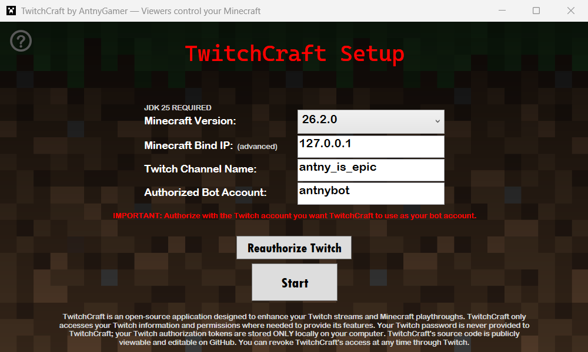
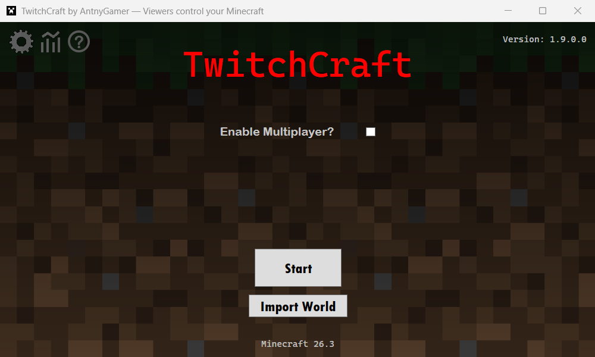
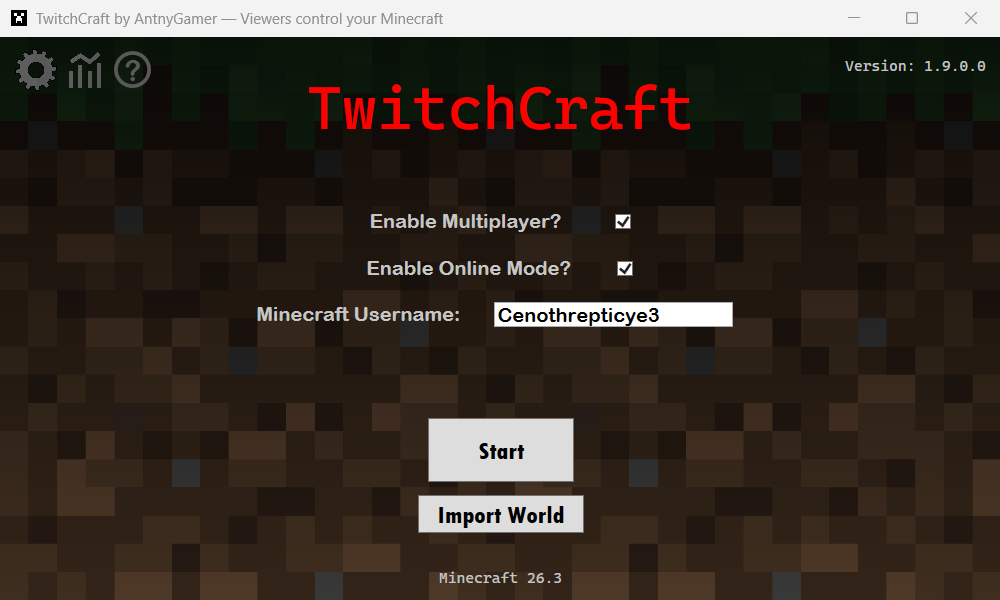
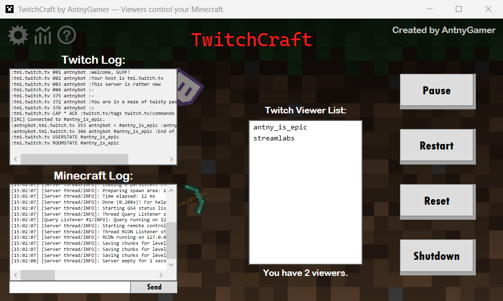
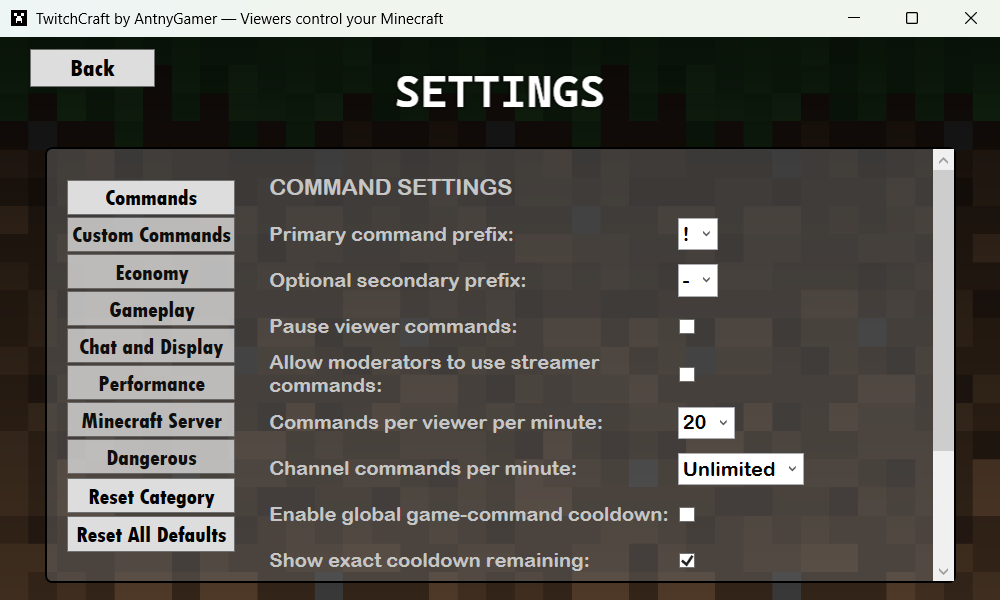

# TwitchCraft User Guide

**// TWITCHCRAFT BOT SCREENSHOT SHOWCASE**

  

  

  

  

  

## Documentation

The repository-local documentation is the canonical source for TwitchCraft setup, commands, and troubleshooting:

* [Installation](docs/INSTALLATION.md)
* [Configuration](docs/CONFIGURATION.md)
* [Commands](docs/COMMANDS.md)
* [Multiplayer](docs/MULTIPLAYER.md)
* [Remote Control](docs/REMOTE-CONTROL.md)
* [Troubleshooting](docs/TROUBLESHOOTING.md)
* [Architecture](docs/ARCHITECTURE.md)
* [Release process](docs/RELEASES.md)
* [Changelog](CHANGELOG.md)
* [Contributing](CONTRIBUTING.md)
* [Security policy](SECURITY.md)
* [AI Assistance Disclosure](docs/NOTE.md)

External tutorials and short links later in this guide are supplemental mirrors. If they disagree with this repository, use the repository-local documentation

## 1. Requirements

* Windows 10/11 (64-bit)
* Use Minecraft Java Edition version 1.20.5–1.21.11 or 26.1–26.2.0
* Install the correct Java Development Kit (JDK) version for the Minecraft version you plan to run

## 2. Java / JDK Setup

For Minecraft versions **1.20.5–1.21.11**:

* You will need Java SE 21 (JDK 21)
* Download: https://www.oracle.com/java/technologies/downloads/#jdk21-windows
* Use the Windows x64 Installer version
* Any JDK 21.x version should work

For Minecraft versions **26.1–26.2.0**:

* You will need Java SE 25 (JDK 25)
* Download: https://www.oracle.com/java/technologies/downloads/#jdk25-windows
* Use the Windows x64 Installer version
* Any JDK 25.x version should work

## 3. Bot Account Setup

* In order for TwitchCraft to function, you need to connect a Twitch account to the application
* Do not use your main Twitch account for the bot if possible
* You will need to be signed into your bot account on Twitch
* Having 2FA enabled is recommended
* Follow the steps in **4. Authorizing Twitch**
* Add the bot as a moderator in your Twitch chat by typing "/mod " followed by your bot's name

## 4. Authorizing Twitch

1. Open `TwitchCraft.exe`
2. Click **Authorize Twitch** above **Start**
3. Approve the displayed device authorization in your browser

* TwitchCraft fills in the bot account automatically and keeps the authorization renewable

## 5. Starting TwitchCraft

**Getting through setup:**
1. Extract the `.zip` to a folder
2. Do not remove any files from the extracted folder
3. Open `TwitchCraft.exe`
4. Enter your:
   * Minecraft version
   * Server Bind IP (optional, advanced users only)
   * Twitch channel / streamer name
5. Complete the steps in **4. Authorizing Twitch**
   * The Twitch bot name is filled in automatically after authorization
6. Make sure all values are correct
7. Confirm that the correct Java version is installed
8. Click **Start**
   * Start cannot be clicked until every required value and the current Twitch authorization are valid
   * TwitchCraft will prepare the Minecraft server and then open the Start screen

**Run the process:**
1. Select whether you want to use multiplayer and then turn offline mode on or off (only available with multiplayer)
2. Enter your Minecraft username if asked
3. If you want to use an existing world, import it before starting
4. Click **Start**

## 6. Settings & Customization

TwitchCraft includes a Settings menu that lets you customize how the bot, Minecraft server, commands, tokens, statistics, backups, and other features behave

**Settings include:**

* Command prefixes
* Custom commands
* Command cooldowns
* Viewer activity requirements
* Token and token-earning settings
* Statistics settings
* Automatic backup settings
* Minecraft server behavior
* Twitch chat and bot behavior
* SQLite optimization interval
* Other advanced options

**Notes:**

* Most settings can be changed directly through TwitchCraft without manually editing `config.json`
* Some settings may only take effect after restarting TwitchCraft or starting a new Minecraft server session
* If you do not understand a setting, it is best to leave it how it is

## 7. Joining the Server (as the Streamer)

1. Make sure you are on the same Minecraft version TwitchCraft is running on
2. Open the Multiplayer tab in Minecraft
3. Add a new server
4. Enter this server address: `127.0.0.1`
5. Wait for TwitchCraft and the Minecraft server to fully start before joining the server

## 8. Multiplayer (Optional)

Enabling multiplayer in TwitchCraft does not automatically make your server publicly reachable

These steps work for most routers, but menu names and settings may vary:

1. Enable multiplayer in TwitchCraft before starting the server
2. Find your local IP and Default Gateway
   1. Press **Win + R**
   2. Type: `cmd`
   3. Type: `ipconfig`
   4. Find:
      * `IPv4 Address`
      * the number-only `Default Gateway` (example: `192.168.1.1`)
3. Open your router login page
   * Type your Default Gateway into a browser
4. Log in to your router
   * You may need your router username and password
5. Find the router setting named one of the following:
   * Port Forwarding
   * NAT
   * Virtual Server
6. Forward TCP port `25565` to your local IP
7. Allow Java through Windows Firewall
8. Have friends connect using your **PUBLIC IP**
   * Search `what is my IP` in a browser

**Notes:**
* Only give your public IP to people that you trust
* If someone is on the same network as you, they should use your local IP instead
* Some ISPs or router setups may require extra steps

## 9. Remote Control Mode (Optional)

Remote Control Mode lets TwitchCraft control an already-running Minecraft server instead of starting its own local server

**Use this mode if:**

* Your Minecraft server is hosted by a server host or on another computer
* You want to collaborate with one or more Twitch streamers
* You want TwitchCraft to control an existing server through RCON

**Important:**

* The remote Minecraft server must already be running
* The remote Minecraft server must have RCON enabled
* TwitchCraft must be able to reach the remote server's RCON port
* Remote Control Mode does not start or stop the remote Minecraft server for you

**On the computer or host running the Minecraft server:**

1. Open `server.properties`
2. Find these settings:
   * `enable-rcon=true`
   * `rcon.port=25575`
   * `rcon.password=YOUR_PASSWORD_HERE`
3. Replace `YOUR_PASSWORD_HERE` with a strong private password
4. Save `server.properties`
5. Restart the Minecraft server
6. Make sure the RCON port is allowed through the server firewall if needed

**In TwitchCraft as the remote user:**

1. Open TwitchCraft
2. Go to the Start screen
3. Press **Ctrl + Alt + R**
4. Remote Control Mode will appear
5. Enter the Remote Host
   * Use the server's public IP or domain if the server is hosted somewhere else
   * Use the server's local IP if the server is on your home network
   * Use `127.0.0.1` if TwitchCraft is running on the same computer as the Minecraft server
6. Enter the RCON Port
   * The default port is `25575`
   * This must match `rcon.port` in `server.properties`
7. Enter the RCON Password
   * This must match `rcon.password` in `server.properties`
8. Enter your Minecraft username if asked
9. Click **Start**

**To leave Remote Control Mode:**

* Press **Ctrl + Alt + R** again on the Start screen

**Safety notes:**

* Never share your RCON password publicly
* Only allow RCON access from people or computers you trust
* If you port forward RCON, use a strong password and understand the security risk

## 10. Server Features

* Twitch chat messages are relayed into Minecraft
* Typing `/trigger locateplayers` in Minecraft chat lets you see the coordinates of all players when in multiplayer
* A player list sidebar is shown in multiplayer
* Player health bars are displayed in the tab list when in multiplayer

## 11. Tokens

**Token earning:**

* By default, all viewers who have your stream open in a browser or the Twitch app earn 1 token every 30–60 seconds
* The payout amount, interval, maximum balance, and recent-chat activity requirement can be changed in Settings

**Other ways to manage tokens:**

* While TwitchCraft is active, you can use these Twitch chat commands:
  * `!givetokens <user/all/random> <amount>`
  * `!removetokens <user/all/random> <amount>`

**Actual token file location:** `%APPDATA%\TwitchCraftBot\viewer_tokens.db` (for reference, paste this path into Win + R or File Explorer)

**Readable token export location:** `%APPDATA%\TwitchCraftBot\exports\viewer_tokens.json`

**Notes:**

* Viewer tokens are stored in `viewer_tokens.db`
* The exported `viewer_tokens.json` file is only for viewing
* Editing the exported JSON file will **NOT** affect TwitchCraft
* Do not edit `viewer_tokens.db` while TwitchCraft is active
* If you manually adjust tokens, edit `viewer_tokens.db` with a SQLite editor while TwitchCraft is shut down

## 12. Statistics

**Notes:**

* Statistics can be enabled or disabled in Settings
* Existing saved stats are still shown when statistics are disabled, but new stats are not counted
* Reset Statistics clears all of the saved statistics

**Statistics track:**

* Game commands run
* Most used command
* Tokens spent
* Effects received by the streamer
* Nicest viewer
* Most dangerous viewer
* Deaths
* Time survived
* Sessions started

**Statistics file location:** `%APPDATA%\TwitchCraftBot\statistics.db`

**Readable statistics export locations:**

* `%APPDATA%\TwitchCraftBot\exports\statistics.json`
* `%APPDATA%\TwitchCraftBot\exports\statistics_viewers.json`

**Technical notes:**

* Editing the exported statistics JSON files will **NOT** affect TwitchCraft
* Do not edit `statistics.db` while TwitchCraft is active
* If you manually adjust statistics, edit `statistics.db` with a SQLite editor while TwitchCraft is shut down

## 13. Changing The Bot Account Or Resetting Config

* If you want to change the Twitch account used by your bot, reauthorize TwitchCraft with the new bot account
* Changing the bot account does not delete `viewer_tokens.db` or `statistics.db`
* If you delete `config.json`, you must set up TwitchCraft again
* After doing this, restart TwitchCraft
* If you have a saved world on the TwitchCraft Minecraft server, it may be affected

## 14. Troubleshooting

Troubleshooting has moved to a document for long-term use and dynamic updating

* [Troubleshooting guide](docs/TROUBLESHOOTING.md)

## 15. Links

* TwitchCraft website: https://antnygamer.wixsite.com/twitchcraft
* TwitchCraft commands: https://rentry.co/bot-commands
* TwitchCraft trailer: https://www.youtube.com/watch?v=HM2Um3Uf1hk
* TwitchCraft setup tutorial: https://bit.ly/tutorial-twitchcraft
* TwitchCraft troubleshooting: https://bit.ly/troubleshooting-twitchcraft

## 16. Other Info

* Never share Twitch authorization credentials or files publicly. Anyone with access to them may be able to control your bot account
* TwitchCraft creates backup config and token database files. These are for reference and are not normally used by TwitchCraft
* Special thanks to Lil_KleinStein, whose Minecraft streams inspired TwitchCraft's theme and creation!

---

TwitchCraft is an independent, community-created project by AntnyGamer and is not affiliated with Mojang or Microsoft

**README version 1.8.0.0 — September 2, 2026**
