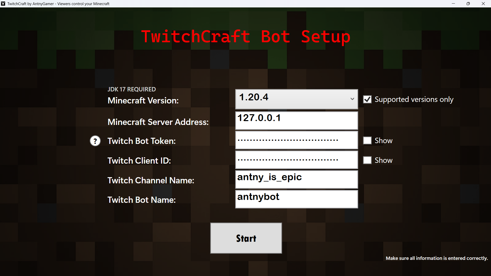
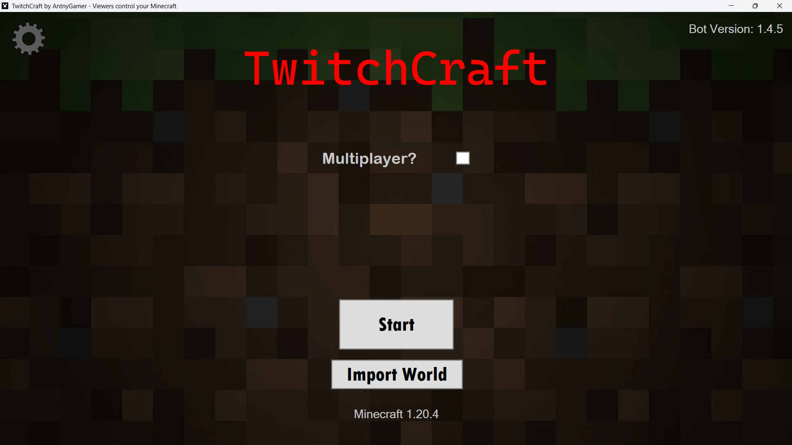
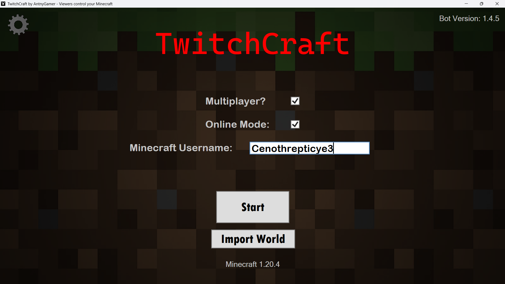
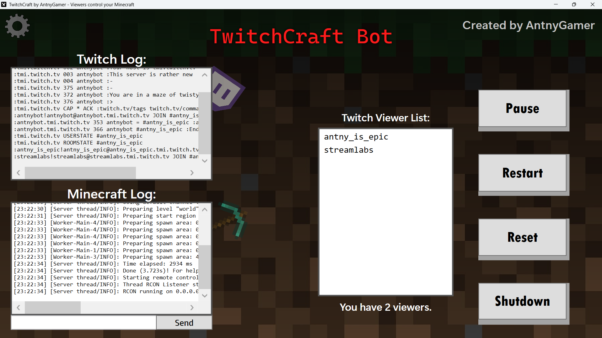
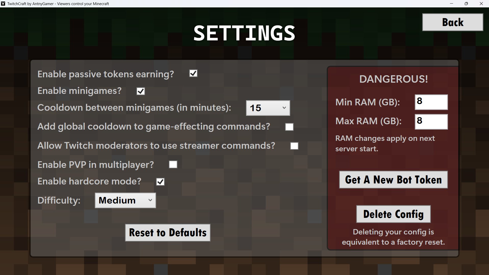

# TwitchCraft User Guide

**// TWITCHCRAFT BOT SCREENSHOT SHOWCASE**

<p align="center">
  
</p>
<p align="center">
  
</p>
<p align="center">
  
</p>
<p align="center">
  
</p>
<p align="center">
  
</p>

## 1. Requirements

* Windows 10/11 (64-bit)
* Install the correct Java Development Kit (JDK) version for the Minecraft version you plan to run
* Use Minecraft Java Edition version 1.20.0–1.21.11 or 26.1–26.2.0

## 2. Bot Account Setup

* Register an application for the bot on the Twitch Developer Console: https://dev.twitch.tv/console
* Do not use your main Twitch account for the bot if possible
* Make sure 2FA is enabled, since it is required to register an application
* Set the OAuth Redirect URL to: `http://localhost`
* Add the bot as a moderator in your Twitch chat by typing `/mod` followed by your bot's name

## 3. Java / JDK Setup

For Minecraft versions **1.20.0–1.20.4**:

* You will need Java SE 17 (JDK 17)
* Download: https://www.oracle.com/java/technologies/javase/jdk17-archive-downloads.html
* Use the Windows x64 Installer version
* Any JDK 17.x version should work

For Minecraft versions **1.20.5–1.21.11**:

* You will need Java SE 21 (JDK 21)
* Download: https://www.oracle.com/java/technologies/downloads/#jdk21-windows
* Use the Windows x64 Installer version
* Any JDK 21.x version should work

For Minecraft versions **26.1–26.2.0**:

* You will need Java SE 25 (JDK 25)
* Download: https://www.oracle.com/java/technologies/downloads/#jdk25-windows
* Use the Windows x64 Installer version
* Any JDK 25.x version should work

## 4. Getting A Bot Token

1. Open `GetBotToken.exe`
2. Enter your bot's Client ID
   * This can be found at: https://dev.twitch.tv/console
3. Enter the Redirect URL: `http://localhost`
4. Get a new Twitch token

## 5. Starting TwitchCraft

1. Extract the `.zip` to a folder
2. Do not remove any files from the extracted folder
3. Open `TwitchCraft.exe`
4. Enter your:
   * Minecraft version
   * Server Bind IP (optional, advanced users only)
   * Twitch Client ID
   * Twitch bot token
   * Twitch channel / streamer name
   * Twitch bot name
   * Minecraft username
5. Make sure all values are correct
6. If you want to use an existing world, import it before starting
7. Click **Start**

## 6. Joining The Server (As The Streamer)

1. Make sure you are on the same Minecraft version TwitchCraft is running on
2. Open the Multiplayer tab in Minecraft
3. Add a new server
4. Enter this server address:

   ```text
   127.0.0.1
   ```

5. Wait for TwitchCraft and the Minecraft server to fully start before joining the server

## 7. Multiplayer (Optional)

Enabling multiplayer in TwitchCraft does not automatically make your server publicly reachable

These steps work for most routers, but menu names and settings may vary:

1. Enable multiplayer in TwitchCraft before starting the server
2. Find your local IP and Default Gateway
   1. Press **Win + R**
   2. Type: `cmd`
   3. Type: `ipconfig`
   4. Find:
      * `"IPv4 Address"`
      * The number-only `"Default Gateway"` (example: `192.168.1.1`)
3. Open your router login page
   * Type your Default Gateway into a browser
4. Log in to your router
   * You may need your router username and password
5. Find the router setting named one of the following:
   * Port Forwarding
   * NAT
   * Virtual Server
6. Forward TCP port `25565` to your local IP
7. Allow Java through Windows Firewall
8. Have friends connect using your **PUBLIC IP**
   * Search `"what is my IP"` in a browser

**Notes:**

* Only give your public IP to people that you trust
* If someone is on the same network as you, they should use your local IP instead
* Some ISPs or router setups may require extra steps

## 8. Remote Control Mode (Optional)

Remote Control Mode lets TwitchCraft control an already-running Minecraft server instead of starting its own local server

Use this mode if:

* Your Minecraft server is hosted by a server host or on another computer
* You want to collaborate with one or more Twitch streamers
* You want TwitchCraft to control an existing server through RCON

**Important:**

* The remote Minecraft server must already be running
* The remote Minecraft server must have RCON enabled
* TwitchCraft must be able to reach the remote server's RCON port
* Remote Control Mode does not start or stop the remote Minecraft server for you

On the computer or host running the Minecraft server:

1. Open `server.properties`
2. Find these settings:

   ```properties
   enable-rcon=true
   rcon.port=25575
   rcon.password=YOUR_PASSWORD_HERE
   ```

3. Replace `YOUR_PASSWORD_HERE` with a strong private password
4. Save `server.properties`
5. Restart the Minecraft server
6. Make sure the RCON port is allowed through the server firewall if needed

In TwitchCraft as the remote user:

1. Open TwitchCraft
2. Go to the Start screen
3. Press **Ctrl + Alt + R**
4. Remote Control Mode will appear
5. Enter the Remote Host
   * Use the server's public IP or domain if the server is hosted somewhere else
   * Use the server's local IP if the server is on your home network
   * Use `127.0.0.1` if TwitchCraft is running on the same computer as the Minecraft server
6. Enter the RCON Port
   * The default port is `25575`
   * This must match `rcon.port` in `server.properties`
7. Enter the RCON Password
   * This must match `rcon.password` in `server.properties`
8. Enter your Minecraft username if asked
9. Click **Start**

To leave Remote Control Mode:

* Press **Ctrl + Alt + R** again on the Start screen

**Safety notes:**

* Never share your RCON password publicly
* Only allow RCON access from people or computers you trust
* If you port forward RCON, use a strong password and understand the security risk

## 9. Server Features

* Twitch chat messages are relayed into Minecraft
* Typing `/trigger locateplayers` in Minecraft chat lets you see the coordinates of all players when in multiplayer
* A player list sidebar is shown in multiplayer
* Player health bars are displayed in the tab list when in multiplayer

## 10. Tokens

**Actual token file location:**

```text
AppData --> Roaming --> TwitchCraftBot --> viewer_tokens.db
```

**Readable token export location:**

```text
AppData --> Roaming --> TwitchCraftBot --> exports --> viewer_tokens.json
```

**Notes:**

* Viewer tokens are stored in `viewer_tokens.db`
* The exported `viewer_tokens.json` file is only for viewing
* Editing the exported JSON file will NOT affect TwitchCraft
* Do not edit `viewer_tokens.db` while TwitchCraft is active
* If you manually adjust tokens, edit `viewer_tokens.db` with a SQLite editor while TwitchCraft is shut down

**Other ways to manage tokens:**

While TwitchCraft is active, you can use these Twitch chat commands:

```text
!givetokens <user> <amount>
!removetokens <user> <amount>
```

**Token earning:**

* All viewers who have your stream open in a browser or the Twitch app earn 1 token every 30–60 seconds

## 11. Statistics

**Statistics file location:**

```text
AppData --> Roaming --> TwitchCraftBot --> statistics.db
```

**Readable statistics export locations:**

```text
AppData --> Roaming --> TwitchCraftBot --> exports --> statistics.json
AppData --> Roaming --> TwitchCraftBot --> exports --> statistics_viewers.json
```

**Notes:**

* Statistics can be enabled or disabled in Settings
* Existing saved stats are still shown when statistics are disabled, but new stats are not counted
* Reset Statistics clears all of the saved statistics
* Editing the exported statistics JSON files will not affect TwitchCraft
* Do not edit `statistics.db` while TwitchCraft is active
* If you manually adjust statistics, edit `statistics.db` with a SQLite editor while TwitchCraft is shut down

**Statistics track:**

* Game commands run
* Most used command
* Tokens spent
* Effects received by the streamer
* Nicest viewer
* Most dangerous viewer
* Deaths
* Time survived
* Sessions started

## 12. Troubleshooting

Troubleshooting has moved to a document for long-term use and dynamic updating

* Troubleshooting guide: https://bit.ly/twitchcraft-troubleshooting

## 13. Changing The Bot Account Or Application

* If you change the account or application used by your bot on the Twitch Developer Console, you must delete or update `config.json`
* Changing the bot account does not delete `viewer_tokens.db` or `statistics.db`
* If you delete `config.json`, you must setup TwitchCraft again
* After doing this, restart TwitchCraft
* If you have a saved world on the TwitchCraft Minecraft server, it may be affected

## 14. Links

* TwitchCraft website: https://antnygamer.wixsite.com/twitchcraft
* TwitchCraft commands: https://rentry.co/bot-commands
* TwitchCraft trailer: https://www.youtube.com/watch?v=HM2Um3Uf1hk
* TwitchCraft setup tutorial: https://bit.ly/twitchcraft-tutorial
* TwitchCraft troubleshooting: https://bit.ly/twitchcraft-troubleshooting

## 15. Other Info

* Never share your Twitch bot token publicly. Anyone with the token may be able to control your bot account until the token is reset
* TwitchCraft creates backup `.bak` config files. These are for reference and are not normally used by TwitchCraft
* Special thanks to Lil_KleinStein, whose Minecraft streams inspired TwitchCraft's theme and creation!
